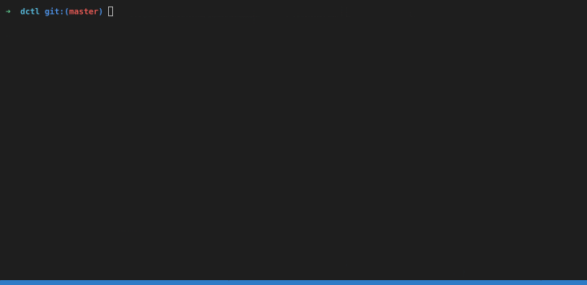

# DCTL

Get your dragonchain out of its shell.

## Description

This commandline tool is a thin wrapper around the [dragonchain nodejs sdk](https://www.npmjs.com/package/dragonchain-sdk) using [commander](https://www.npmjs.com/package/commander).

```sh
Usage: dctl [options] [command]

Options:
  -V, --version       output the version number
  -h, --help          output usage information

Commands:
  status|s            Get the status of your chain.
  transaction|t       Commands for interfacing with transactions.
  transactionType|tt  Commands for interfacing with transaction types.
  contract|c          Commands for interfacing with contracts
  block|b             Commands for interfacing with blocks
  creds|k             Manage dragonchain credentials on this machine.
  publicAddresses|p   Get public blockchain addresses.
  help [cmd]          display help for [cmd]
```

## System Requirements

* NodeJs > 10.0
* npm

## Install

Install using NPM

```sh
$ npm install -g dctl
> ...
```

## Usage Examples

Here is a quick example showing SmartContract creation and invocation:



### Getting Help

```sh
$ dctl --help
> ...
```

```sh
$ dctl <anyCommand...> --help
> ...
```

### Credentials

#### Adding New Dragonchain Credentials

```sh
$ dctl creds add yourDcIdHere -e http://localhost:8080
> HMAC KEY ID: UAKRHCSOKTYH
> HMAC KEY: ***********************************************
> Default Dragonchain set to yourDcIdHere.
> Success. New Credentials written to /Users/?/.dragonchain/credentials
```

#### Listing Dragonchain Credentials

```sh
$ dctl creds ls
>   {
    "default": {
      "dragonchain_id": "..."
    },
    "...": {
      "auth_key": "<hidden>",
      "auth_key_id": "UAKRHCSOKTYH",
      "endpoint": "..."
    }
  }
```

#### Alias/Shorthand Commands

Most commands/subcommands have a one-letter alias.

```sh
$ dctl t c MyTransactionType 'Hi there!'
> { "status": 201, "response": { "transaction_id": "..." }, "ok": true }
```

Is equivilent to...

```sh
$ dctl transaction create MyTransactionType 'Hi there!'
> { "status": 201, "response": { "transaction_id": "..." }, "ok": true }
```

#### Getting Transactions

```sh
$ dctl transaction get 7d1fa05a-ea6f-44a5-a1b8-8568eb701a8c
> { "status": 201, "response": {...}, "ok": true }

```

### Updating Contracts

```sh
$ dctl c u a57afbb0-9cab-4538-adf8-2fdbce9102fc -A newArg1 -A newArg2
> {
  "status": 202,
  "response": {
    "success": {
      "dcrn": "SmartContract::L1::AtRest",
      "version": "1",
      "txn_type": "coolcontract",
      "id": "a57afbb0-9cab-4538-adf8-2fdbce9102fc",
      "status": {
        "state": "Updating",
        "msg": "Contract updating",
        "timestamp": "2019-06-07 17:35:54.720967"
      },
      "image": "dragonchain/interchain-watcher:prod-1.0.0",
      "auth_key_id": null,
      "image_digest": null,
      "cmd": "node",
      "args": [
        "newArg1",
        "newArg2"
      ],
      "env": {
        "address": "0x9DF7aeAD32989b4B533d941d3D799eB302E5A804",
        "network": "custom",
        "customNetworkUrl": "http://10.2.1.123:8545",
        "callbackUrl": "https://callmeback.edu"
      },
      "existing_secrets": null,
      "cron": null,
      "seconds": 6,
      "execution_order": "serial"
    }
  },
  "ok": true
}
```

### Creating Contracts

```sh
$ dctl c c coolcontract dragonchain/interchain-watcher:prod-1.0.0 node index.js -n 6 -s -e '{"myvar":"custom","whatever":"foo"}'
> {
   "status": 202,
   "response": {
     "success": {
       "dcrn": "SmartContract::L1::AtRest",
       "version": "1",
       "txn_type": "PrivateEthWatcher",
       "id": "a57afbb0-9cab-4538-adf8-2fdbce9102fc",
       "status": {
         "state": "Pending",
         "msg": "Contract creating",
         "timestamp": "2019-06-07 17:35:54.720967"
       },
       "image": "dragonchain/interchain-watcher:prod-1.0.0",
       "auth_key_id": null,
       "image_digest": null,
       "cmd": "node",
       "args": [
         "index.js"
       ],
       "env": {
         "myvar": "custom",
         "whatever": "foo",
       },
       "existing_secrets": null,
       "cron": null,
       "seconds": 6,
       "execution_order": "serial"
     }
   },
   "ok": true
 }
```

## Helpful Jq Alias'

### Prerequisites

* Install the [jq](https://stedolan.github.io/jq/) package to parse the dctl output.

```sh
# ~/.bashrc
alias d-scls="dctl c ls | jq '.response.results[] | [(.txn_type, .id)]' | jq -s ."
```

### Examples

```sh
# List Smartcontracts Names, Ids
$ d-cls

> [[
    "coolcontract",
    "4b95544c-d1a0-4f4a-ab9d-a098e3a1ce6a"
  ],[
    "myContract",
    "7ccfae39-5e93-4ca3-ad9e-7d1edf5ce3c2"
  ]]
```

## Contributing

Dragonchain is happy to welcome contributions from the community. You can get started [here](https://github.com/dragonchain-inc/dctl/blob/master/CONTRIBUTING.md).
